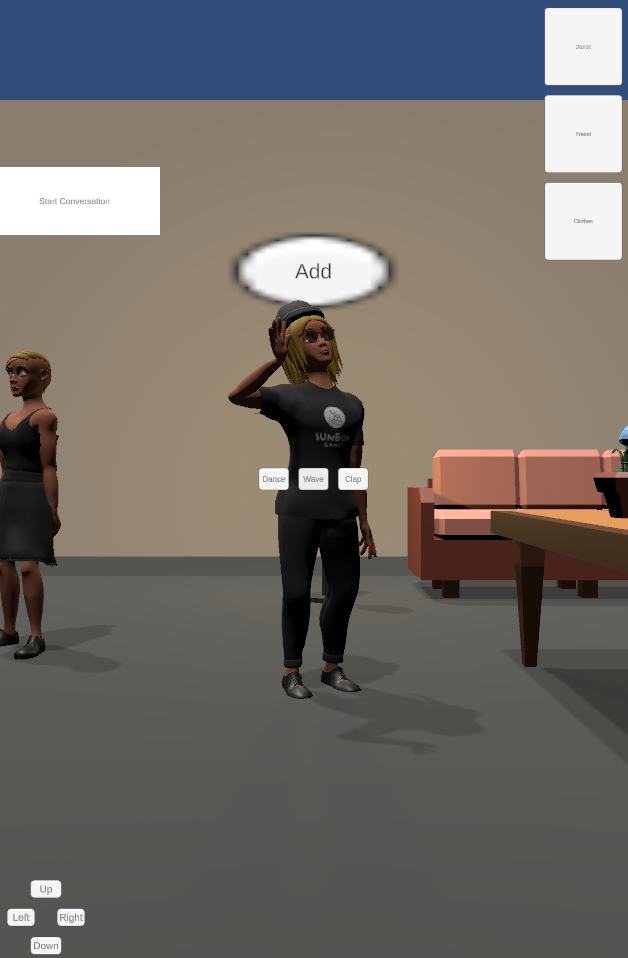
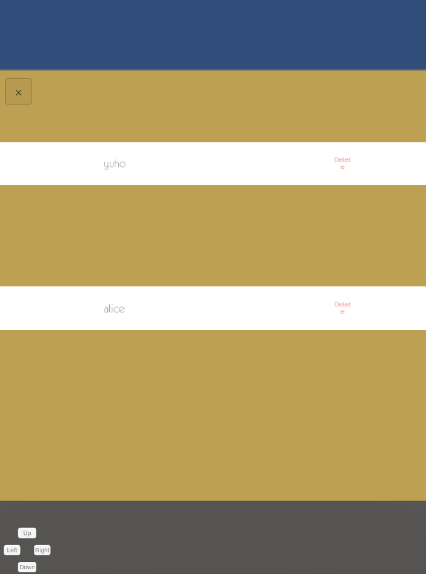
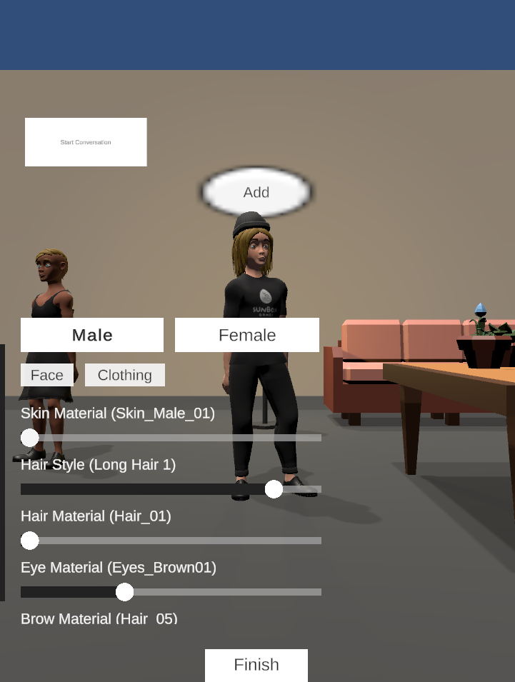
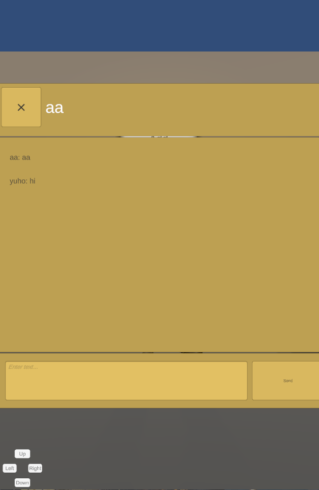
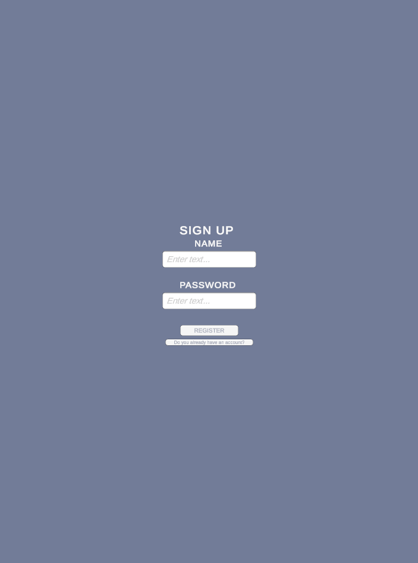
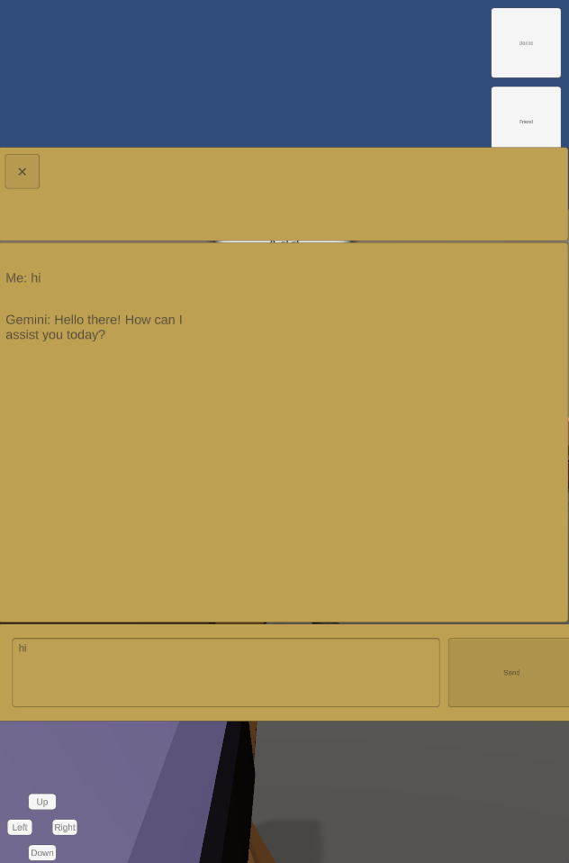

# Metaverse Chat App

## Overview 
Metaverse Chat App is a Unity-based application that enables users to interact in a virtual space with customizable avatars. Users can communicate with friends, explore the environment, and chat with an AI bot. The app utilizes PUN 2 for multiplayer networking and SQLite for database management.

## Features 
- Login & Logout: Secure user authentication and session management.
- Avatar Customization: Users can change their avatar appearance.
- Movement: Navigate within the virtual environment.
- Friend Management: Add or remove friends.
- Chat with Friends: Communicate with added friends in real-time.
- Chat with AI Bot (Gemini): Interact with an AI-powered chatbot.

<table>
  <tr>
    <td></td>
    <td></td>
    <td></td>
  </tr>
  <tr>
    <td></td>
    <td></td>
    <td></td>
  </tr>
</table>

## Technologies Used
- SQL: Used for managing user data and friend lists.

### Assets
- [PUN 2](https://assetstore.unity.com/packages/tools/network/pun-2-free-119922) Networking solution for real-time multiplayer functionality.
- [SQLiter](https://assetstore.unity.com/packages/tools/integration/sqliter-20660)  SQLite integration for local data storage.
- [Low Poly Simple Furniture FREE](https://assetstore.unity.com/packages/3d/props/furniture/low-poly-simple-furniture-free-240197)  3D assets for environmental design.
- [Stylized Customizable Avatars FREE](https://assetstore.unity.com/packages/3d/characters/humanoids/stylized-customizable-avatars-free-230391) Customizable character models.
